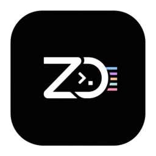

<div align="center">



# ZeroCode

**A native control room for running several coding agents at once — each in its own git worktree, each in its own terminal pane, and none of them quietly stuck.**

[](LICENSE)
[](rust-toolchain.toml)
[](#building)

</div>

---

Coding agents are good at working alone and bad at telling you when they need you. Run three of
them and the work is no longer the hard part — knowing which pane is waiting on a permission
prompt, which branch a worktree belongs to, and which task was actually finished is.

ZeroCode is the room those agents work in. It runs the agent CLIs you already have — unmodified,
in real PTYs — and puts a ledger, a board, and a worktree under them.

```
┌ projects ─┬─ workspace ────────────────────────┬─ board ──────────┐
│ zerocode  │  ● claude   wt/t-4183  needs you   │  ◆ needs you  1  │
│ · api     │  ○ codex    wt/t-4190  working     │  ◆ working    2  │
│ · web     │  ○ zo       wt/t-4201  working     │  ◆ done       5  │
└───────────┴────────────────────────────────────┴──────────────────┘
        a pane per agent · a worktree per task · one ledger
```

## What it does

| | |
|---|---|
| **Agent panes** | Runs installed agent CLIs as-is in a PTY — no reimplementation. A loopback hook bridge lifts each pane's state (working · needs you · done) and its current tool into the window. Close the window and a pane comes back on the same conversation; a pane cut off mid-turn gets nudged to continue. |
| **Worktrees** | One task, one git worktree. Create it from the sidebar, open panes inside it, sweep it once it lands. |
| **Agent board** | A live graph of project → workspace → agent → helper. Cards that need you can be answered or approved in place, and each card says what its agent last reached for. Mail, dependency, and merge overlays. |
| **Orchestration ledger** | `zerocode-orc` records runs, tasks, workers, gates, and mail. A coordinating agent summons workers into their own panes, collects their reports, and answers their questions — every briefing and receipt goes through the ledger, never a background pipe. |
| **`zo`** | A coding agent CLI of its own, in this repo. Anthropic, OpenAI, and Google providers; OAuth that follows the window's account; subagents and teammate panes; `/goal` and `/loop` autonomous runs; model catalog discovery. |
| **Second brain** | Draws an Obsidian vault as a knowledge graph — typed relations, hubs, orphans, ghost links — so what an agent learns is written down and linked rather than lost. |
| **Browser · emulator · desktop** | A browser inside the window (with profile and cookie import), iOS and Android emulator mirrors, and desktop Computer Use. Agents drive the same surfaces through `zerocode-browser`, `zerocode-emulator`, and `zerocode-computer`. |
| **Automation** | Schedule prompts and commands against a workspace; each run leaves an evidence folder (`steps.jsonl` plus screenshots). |
| **Integrations** | GitHub, GitLab, Jira, and Linear task pages; SSH remote workspaces; port and localhost labels; a session archive you can reopen. |

Five interface languages: English, 한국어, 日本語, 中文, Español.

## Supported agents

The catalog in `crates/zerocode-core/src/agent.rs` is the source of truth — **35 agents** as of
v1.3.110:

`zo` · `claude` · `openclaude` · `codex` · `devin` · `ante` · `trae` · `autohand` · `opencode` ·
`mimo-code` · `pi` · `omp` · `prime-agent` · `antigravity` · `aider` · `goose` · `amp` · `kilo` ·
`kiro` · `crush` · `aug` · `cline` · `codebuff` · `command-code` · `continue` · `cursor` ·
`droid` · `kimi` · `mistral-vibe` · `qwen-code` · `rovo` · `hermes` · `openclaw` · `copilot` ·
`grok`

Only the ones actually installed show up (`zerocode-orc agent-list`), and the app writes each
agent's hook script into that agent's own home.

## Building

There are no published binaries yet — build it from source.

**Requirements:** Rust stable 1.94+, Node 22+, Tauri CLI 2.11.

```bash
just shell                 # run the window (development build)
just verify                # the full gate: fmt · clippy · rustdoc · tests · browser harnesses
just package-macos         # unsigned local bundle (smoke test)

cd zo-ide && cargo build --release -p zo-ide   # the zo CLI on its own
```

A shipped build is a signed, notarized `.dmg` on macOS and `.msi`/NSIS on Windows. The version
lives in the root `Cargo.toml` under `[workspace.package]`, and `tools/release/bump.sh` moves it
everywhere at once — no version numbers are hand-written into docs.

> A running app bundle or `zo` binary is never overwritten in place; that invalidates the code
> signature and the OS kills the process. New bytes land beside the old ones and swap atomically.

## How it is put together

```
crates/
  zerocode-core          domain vocabulary — agent catalog, hook state, pane keys, accounts
  zerocode-shell         the window (Tauri): commands, per-domain runtimes, source contracts
  zerocode-hookd         loopback hook bridge (agent → window)
  zerocode-harness       zo event channel client (JSON-RPC over loopback)
  zerocode-pty           PTY host and the VT grid Rust owns
  zerocode-orchestrator  the ledger — runs, tasks, workers, gates, mail
  zerocode-lane          zo pane wiring
  zerocode-ssh           verified SSH connections
  zerocode-devproxy      localhost worktree label socket
  zerocode-app           the `zerocode` CLI entry point
ui/                      the window's screens (vanilla JS/CSS); ui/tokens.css holds the values
zo-ide/                  the `zo` CLI workspace (runtime · api · tools)
skills/                  skills installed into agents (orchestration, computer-use, second-brain)
```

Rust owns the terminal grid, the PTYs, the ledger, and every process boundary. The window is
Tauri rather than Electron — one native process, not a browser runtime per pane.

## Testing

`just verify` is the gate, and it is read by its exit code, never through a pipe.

| Gate | What it covers |
|---|---|
| `just verify` | Rust tests, source contracts, `clippy -D warnings`, rustdoc, window and settings browser harnesses |
| `node ui/tests/window.mjs` | the window harness — board, graph, terminal, restore, performance contracts |
| `node ui/tests/settings.mjs` | the settings harness |
| `cd zo-ide && just verify` | zo units, hermetic e2e, TUI byte goldens, harness budgets |
| `.github/workflows/verify.yml` | macOS and Windows matrix, plus an unsigned package smoke test |

Roughly 11,000 Rust tests run across the two workspaces. A flake under load is judged by a solo
rerun, never by muting the gate.

## Principles

1. **A stuck pane cannot stay quiet.** Anything that needs a person is promoted to the board, the
   sidebar, and a notification.
2. **Hooks always succeed and finish fast.** They report; they never block an agent's turn.
3. **No code path answers a permission prompt on your behalf.**
4. **Loopback plus a token is the only default.** Nothing listens on a public interface.
5. **Unknown frames and fields are passed through,** not turned into a failed turn.

## License

MIT — see [LICENSE](LICENSE).
